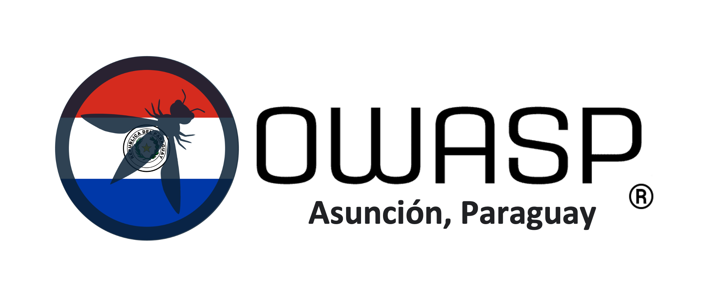

---

layout: col-sidebar
title: OWASP Asuncion, Paraguay
tags: Paraguay
meetup-group: owaspasuncion
region: South America

---

  

<figure></figure>

<h1 id="bienvenidos_a_owasp_asuncion">Sobre el capítulo OWASP Asunción</h1>
Buscamos difundir temas de Seguridad de la Información en Aplicaciones. Concientizar y sensibilizar tanto a organizaciones, empresas, universidades, estudiantes, desarrolladores como también fomentar eventos de capacitación de seguridad en el Paraguay. 
El capítulo internacional de <strong>OWASP Asunción, Paraguay</strong> tiene la misión de promover la seguridad de las aplicaciones y fomentar buenas prácticas en el desarrollo seguro de software en el país. Su visión es convertirse en un referente en seguridad de aplicaciones en Paraguay, brindando educación, concienciación y recursos para ayudar a proteger la información y los sistemas de las organizaciones.  
El propósito del capítulo de Paraguay es establecer un ambiente colaborativo en el que profesionales, estudiantes y entusiastas de la seguridad puedan compartir conocimientos, experiencias y soluciones relacionadas con la seguridad de las aplicaciones. A través de la organización de eventos, talleres, conferencias y la creación de una red de expertos en el campo, el capítulo busca fortalecer la comunidad de seguridad informática en Paraguay y contribuir al avance de la industria local.
<h2><strong>Valores</strong></h2>
Los valores del capítulo de Paraguay de OWASP se basan en los principios fundamentales de OWASP a nivel global. Estos valores incluyen: 
1. Comunidad: Fomentar la colaboración y el intercambio de conocimientos entre los miembros del capítulo, promoviendo un ambiente inclusivo y respetuoso. 
2. Transparencia: Actuar de manera transparente en todas las actividades del capítulo, desde la gestión de recursos hasta la toma de decisiones, para generar confianza en la comunidad y los socios. 
3. Educación: Promover la concienciación y la educación en seguridad de aplicaciones web, brindando recursos, capacitaciones y oportunidades de aprendizaje para todos los niveles de conocimiento. 
4. Innovación: Estar a la vanguardia de las últimas tendencias y tecnologías en seguridad de aplicaciones web, fomentando la investigación y el desarrollo de soluciones innovadoras. 
5. Integridad: Actuar con integridad y ética en todas las actividades del capítulo, manteniendo altos estándares de profesionalismo y responsabilidad. 
En resumen, la misión del capítulo de Paraguay de OWASP es promover la seguridad de las aplicaciones, su visión es convertirse en un referente en el país, su propósito es establecer un ambiente colaborativo y su valores se basan en la comunidad, transparencia, educación, innovación e integridad.
<h3><strong>Sin fines de lucro, organización de voluntarios:</strong></h3>
<ul style="list-style-type:disc;">
  <li>Todos los miembros son voluntarios</li>
  <li>Todo el trabajo es donado por los patrocinadores</li>
</ul>
<h3><strong>Proporcionar recursos gratuitos para la comunidad:</strong></h3>
<ul style="list-style-type:disc;">
  <li>Publicaciones, artículos, normas</li>
  <li>Software de Testeo y Capacitación</li>
  <li>Capítulos locales & Listas de correo</li>
</ul>
<h2><strong>¿Cómo puedo participar?:</strong></h2>
<ul style="list-style-type:disc;">
  <li>Individualmente</li>
  <li>Universidad o centro educativo</li>
  <li>Empresa</li>

  
. 

  
